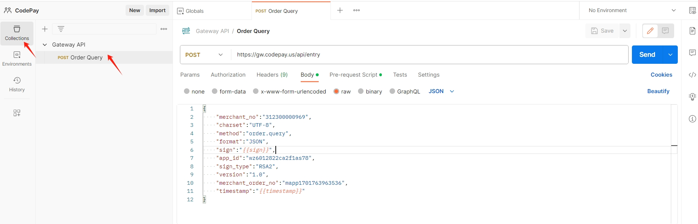
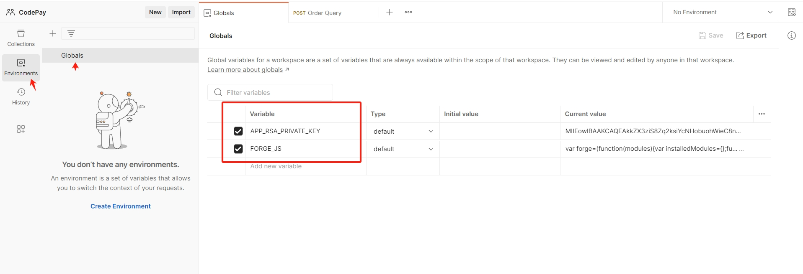
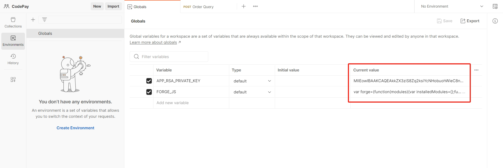
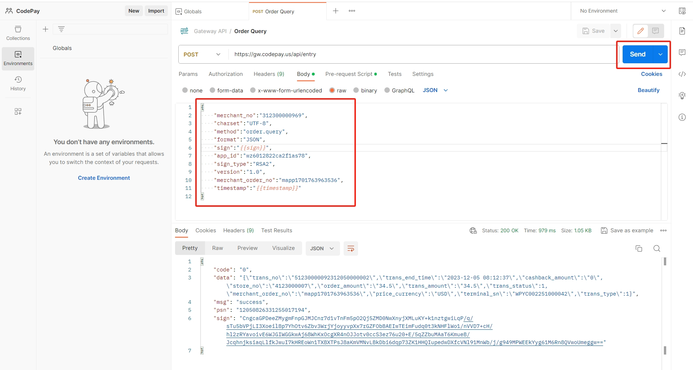
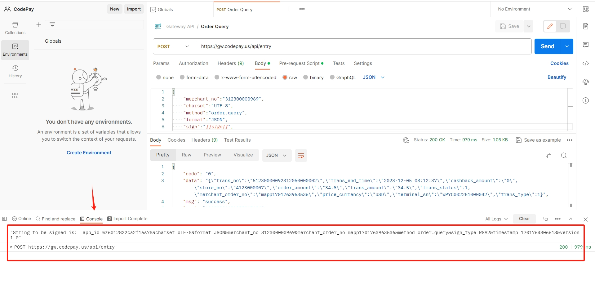

# Postman test script instructions

The Postman test script written in JavaScript language can use the rich functions provided by Postman to conveniently test the PayCloud API, understand the process of integrating PayCloud rest API through HTTP, including adding and verifying signatures for calling payment gateway APIs.

The following steps provide a detailed description of how to add test scripts to your Postman tool.

#### 1. Please ensure that you have installed Postman. If not, please go to the official website <a href = "https://www.postman.com/downloads/" target="_blank">download</a>.

#### 2. Import the collection API File &nbsp; <a href = "https://github.com/codepay-us/gateway-api-demo-postman/blob/main/Gateway-api.postman_collection.json" target="_blank">Gateway-api.postman_collection.json</a> to Postman.

 

#### 3. Import the globals variable file &nbsp; <a href = "https://github.com/codepay-us/gateway-api-demo-postman/blob/main/Gateway-api.postman_globals.json" target="_blank">Gateway-api.postman_globals.json</a> to Postman.

 

#### 4. Set the value of Globals.

APP_RSA_PRIVATE_KEY: It is your application's private key in PKCS1 format.  
Please copy the content of <a href = "https://github.com/codepay-us/gateway-api-demo-postman/blob/main/FORGE_JS.js" target="_blank">FORGE_JS.js</a> to FORGE_JS variable.

 

#### 5. Send HTTP requests, test APIs, and you can modify the parameter values of the Body.

 

#### 6. To view the process log, click on Console.

 
